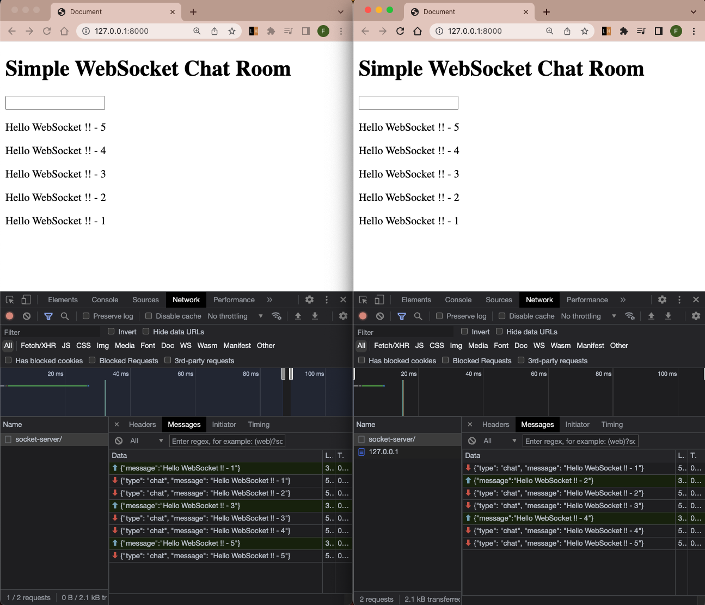

# WebSocket Study 01 - Simple Chat Room

<br>

### 1. Introduction
   
   장고의 채널과 웹소켓 통신을 이용하여 간단한 채팅 기능을 구형하였습니다.<br>
   유투브 영상을 따라가며 코드를 이해하고 구현하는 과정을 기록하였으며,<br>
   해당 기록은 아래 4번에서 확인 할 수 있습니다.
   

<br>
<br>

### 2. Reference 

[Django Channels & WebSockets Oversimplified](https://www.youtube.com/watch?v=cw8-KFVXpTE)

<br>
<br>

### 3. Result
 



<br>
<br>

### 4. Development Process History

```text
1. Set python interpreter
    1.1 Virtual environment
        1.1.1 name "venv_ws"

2. pip package
    2.1 Make requirements.txt
        1.1.1 Add Django
        1.1.2 Add python-dotenv>=0.21.0,<0.22.0 (for .env file)
        1.1.3 Add channels>=3.0.3,<4.0.0 (for websocket)
    2.2 Install packages from requirements.txt
        1.2.1 "pip install -r requirements.txt"

3. Start project
    3.1 Start Django project
        3.1.1 "django-admin startproject config ."
    3.2 Run Server
        3.2.1 "python manage.py runserver" -> Confirm that the server is running

4. Hide Env data
    4.1 Install package "python-dotenv"
    4.2 Make .env file in config directory
    4.3 Set code on Settings.py
        4.3.1 Load package, load_dotenv(), os.environ.get('VARIABLE')

5. Start app "chat"
    5.1 "python manage.py startapp chat"
    5.2 Add "chat" into INSTALLED_APPS on settings.py
    5.3 mkdir "chat/templates/chat"
        5.3.1 Make lobby.html in "chat/templates/chat"
    5.4 View function
        5.4.1 Make view function in "chat/views.py"
        5.4.2 render(request, 'chat/lobby.html')
    5.5 Url routing -> Routing chat app to root path (/)
        5.5.1 Make file url.py in "chat"
        5.5.2 Add path('', views.lobby, name='lobby') in "chat/urls.py"
        5.5.3 Add path('', include('chat.urls')) in "config/urls.py"

6. Channels
    6.1 Install package "channels"
        6.1.1 add channels to requirements.txt
            6.1.1.1 WARNING: channels version should be blow 4.0.0 (I used 3.0.5)
        6.1.2 "pip install -r requirements.txt"
    6.2 On settings.py
        6.2.1 Add "channels" to INSTALLED_APPS
        6.2.2 Add "ASGI_APPLICATION = 'config.asgi.application'"
    6.3 Creating routing configuration
        6.3.1 On config/asgi.py
            6.3.1.1 Import ProtocolTypeRouter
            6.3.1.2 Set ProtocolTypeRouter on application
    6.4 Confirm ASGI/Channels working
        6.4.1 Run server - Checkup message of ASGI/Channels
        It should show "Starting ASGI/Channels version 3.0.5 development server at..."

7. Make javascript on lobby.html
    7.1 Create WebSocket object
    7.2 Parse json data and print on console.log
        7.2.1 It would Fail but could see the message of WebSocket connection

8. chat/consumers.py
    8.1 consumer.py is the channel's version of Django view.py
    8.2 Create consumer.py
        8.2.1 import json, WebsocketConsumer
        8.2.2 Create ChatConsumer class
            8.2.2.1 Create connect method includes self.accept(), self.send()

9. Create chat/routing.py
    9.1 import re_path, consumers(chat/consumers.py)
    9.2 Create websocket_urlpatterns
        9.2.1 re_path: ws url, ChatConsumer.as_asgi()

10. on config/asgi.py
    10.1 import URLRouter, AuthMiddlewareStack
        10.1.1 'AuthMiddleware' requires 'SessionMiddleware' to function,
                which itself requires 'CookieMiddleware'.
                For convenience, these are also provided
                as a combined callable called 'AuthMiddlewareStack'
                that includes all three.
    10.2 Set websocket_urlpatterns on application
        10.2.1 import chat.routing
        10.2.2 add 'websocket': AuthMiddlewareStack(...) in application
    10.3 From now, Do initial migrate and restart server
        10.3.1 Because the django session framework need a database now
        10.3.2 Commands
            10.3.2.1 "python manage.py migrate"
            10.3.2.2 "python manage.py runserver"
        10.3.3 Checkup message of ASGI/Channels
            10.3.3.1 On console.log, There's json data
                    which received from ChatConsumer.connect.send(text_data)
        10.3.4 This was not a response that it get back from the server
                but rather a message that it sent to itself
                (initialized by the server)
    10.4 Result: WebSocket connection is built 🎉🎉🎉
        If The server receives GET / and returns 200 OK
        Terminal shows HANDSHAKING and CONNECT messages


****************************** STOP NOW ******************************

From here, What's happened ?
    -> When server starts !!
        ASGI works on config/asgi.py
        URL Router works on chat/routing.py
        WebSocket url pattern works on chat/consumers.py
        connect.accept() works on chat/consumers.py
        connect.send(text_data) works on chat/consumers.py
        WebSocket connection is built
        Server sends data to client
        Client receives data from server
        Client shows data on console.log

***********************************************************************


11. WebSocket 1 - Get the message from received data
    11.0 Goal:
        Sending a message from the client to the server
        and printing the received data on the Python console
    11.1 Check if the WebSocket is open or not
        11.1.1 If the WebSocket is opened, show a message on the Python console:
            WebSocket HANDSHAKING /ws/socket-server/ [127.0.0.1:*****]
            WebSocket CONNECT /ws/socket-server/ [127.0.0.1:*****]
    11.2 On lobby.html:
        11.1.1 Implement the <form> tag for sending text messages
    11.3 In JavaScript:
        11.3.1 Get the <form> tag and create an event listener for 'submit'
        11.3.2 Perform actions in the following order:
            e.preventDefault() -> chatSocket.send() -> form.reset()
    11.4 On chat/consumers.py:
        11.4.1 Create a receive method
            11.4.1.1 When the client sends data to the server, the receive method is called
            11.4.1.2 The receive method receives text_data as a parameter, which could be parsed as JSON data
            11.4.1.3 Print the received data on the Python console Successfully🌟


12. Receive back the message from the server and Display it on the client HTML
    12.1 On chat/consumers.py:
        12.1.1 Send the message back to the client using self.send(text_data=json.dumps(...))
    12.2 On onmessage function in lobby.html:
        12.2.1 Get data (parsed data variable has had data from server)
        12.2.2 If data has 'chat' key and value, Insert message to HTML
    12.3 PROBLEM: The message is only shown on the client who sent the message


13. Show the message on all clients
    13.1 On Setting.py
        13.1.1 CHANNEL_LAYER = {...}
    13.2 On chat/consumers.py
        13.1 On connect method
            13.1.1 This method is called When client connect to server
            13.1.2 <async> Grouping clients to one group 'test' when they connect websocket
        13.2. On receive method
            13.2.1 This method is called When server get a text data
            13.2.2 When server get a text data, <async> self.channel_layer.group_send() Throws a data
                    to all clients in group 'test' with {'type': 'chat_message'}
        13.3 On chat_message method
            13.3.1 This method is called when <async> call the group_send method


14. Flow
    14.1 Client connect to server (Open WebSocket)
    14.2 Server get a text data from client
    14.3 Server receive() throws the data to the group
    14.4 Server get the data
    14.5 Server channel_layer.group_send() with {'type': 'chat_message'} triggers chat_message()
    14.6 Server chat_message() sends the text data to all clients in group
    14.7 Client(s) get the text data
    14.8 Client(s) render a message from the data on HTML
```
  